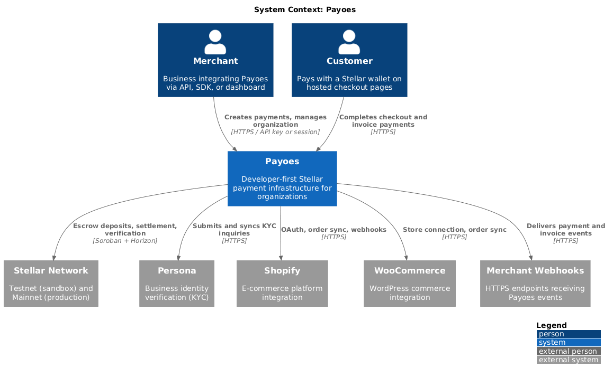
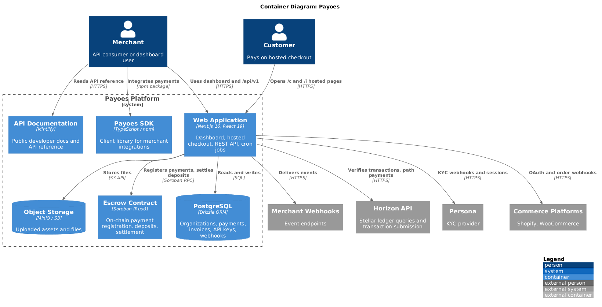
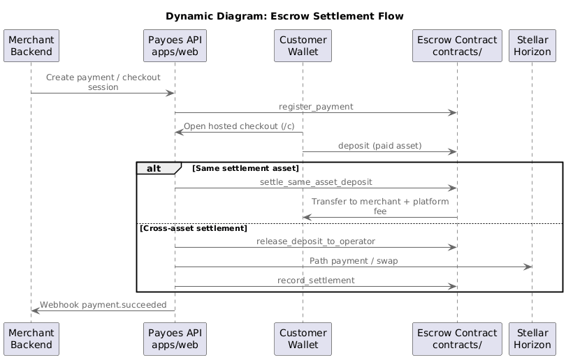
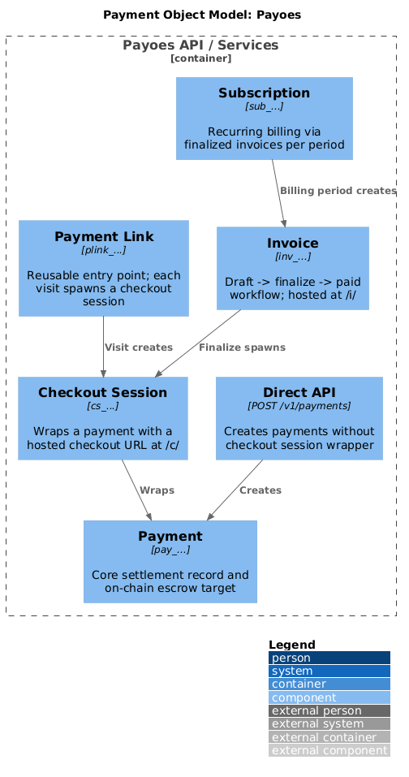

# Architecture

Payoes uses the [C4 model](https://c4model.com/) to describe how merchants, customers, and external systems interact with the platform. Diagrams are authored as PlantUML in this folder and exported to PNG for the root [README](../../README.md).

## System context (C4 Level 1)

Shows Payoes in relation to merchants, customers, and external systems (Stellar, Persona, Shopify, WooCommerce, merchant webhooks).



**Source:** [`c4-context.puml`](c4-context.puml)

## Containers (C4 Level 2)

Shows the main building blocks inside Payoes: web app, SDK, docs, PostgreSQL, object storage, and the Soroban escrow contract.



**Source:** [`c4-container.puml`](c4-container.puml)

## Escrow settlement flow

Dynamic view of how a payment moves from registration through deposit to settlement on the Soroban escrow contract.



**Source:** [`c4-escrow-flow.puml`](c4-escrow-flow.puml)

### Flow summary

1. Merchant creates a payment or checkout session through the Payoes API.
2. Payoes registers the payment on the escrow contract (`register_payment`).
3. Customer opens hosted checkout and deposits the paid asset (`deposit`).
4. **Same settlement asset:** Payoes calls `settle_same_asset_deposit` and the contract pays merchant and platform fee.
5. **Cross-asset settlement:** Payoes releases the deposit to the operator, performs a path payment via Horizon, then calls `record_settlement`.
6. Payoes delivers a `payment.succeeded` webhook to the merchant.

Contract source: [`contracts/`](../../contracts/).

## Payment object model

A separate component diagram covers payment links, checkout sessions, invoices, and subscriptions.



**Source:** [`c4-payment-model.puml`](c4-payment-model.puml)

## Regenerating diagram images

After editing any `.puml` file in this folder:

```bash
docker run --rm \
  -v "$(pwd)/docs/architecture:/data" \
  -v "$(pwd)/assets/architecture:/output" \
  plantuml/plantuml -tpng -o /output \
  /data/c4-context.puml \
  /data/c4-container.puml \
  /data/c4-escrow-flow.puml \
  /data/c4-payment-model.puml
```

PNG output is written to [`assets/architecture/`](../../assets/architecture/) for use in the root README and this page.
