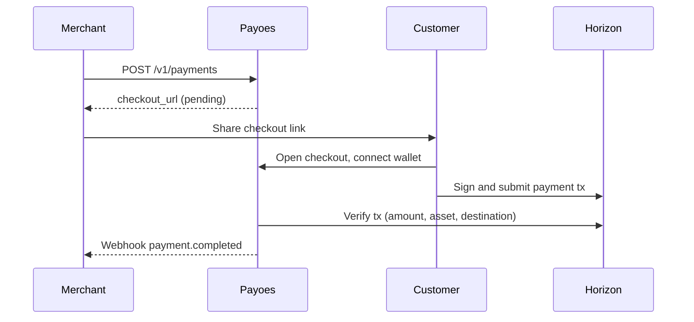

Payoes follows a Stripe-like mental model adapted for Stellar blockchain payments.

## Roles

| Role | Description |
|------|-------------|
| **Merchant** | Your business. Uses the dashboard and API to create payments and manage settings. |
| **Customer** | The person paying. Opens checkout and approves a Stellar transaction. No Payoes account required. |
| **Organization** | Your merchant account in Payoes. Holds settings, API keys, and payment history. |

## Resources

### Organization

An organization represents one business on Payoes. During onboarding you provide a name, logo, and contact details.

Each organization has:

- A **sandbox** or **production** environment
- A **receiving wallet** per environment
- Its own API keys, payments, and webhooks

### Receiving wallet

The Stellar public key where customer payments are sent. Configured during onboarding and editable in **Settings → Receiving Wallet**.

Payoes reads this address when building checkout transactions and when verifying payments on Horizon.

### Payment

A single payment request, equivalent to a Stripe Payment Intent.

| Field | Meaning |
|-------|---------|
| `id` | Public ID (`pay_...`) used in URLs and API calls |
| `amount` | Stellar amount (up to 7 decimal places) |
| `asset` | `XLM` (native) or `USDC` |
| `status` | `pending`, `completed`, `failed`, or `expired` |
| `checkout_url` | Hosted page where the customer pays |

Payments are created via the dashboard or API. Each payment gets a unique checkout link.

### Checkout

A public hosted page at `/c/{payment_id}`.

The checkout flow:

1. Load payment details and merchant branding
2. Customer connects a Stellar wallet (Wallet Kit)
3. Payoes builds an unsigned transaction server-side
4. Customer signs and submits via their wallet
5. Payoes verifies the transaction on Horizon
6. Payment status updates to `completed`

Customers never log into Payoes.

### Transaction

After a successful payment, the Stellar **transaction hash** (`tx_hash`) is stored on the payment record. You can look it up on Stellar Explorer for the corresponding network (testnet or mainnet).

### Payment link

In the dashboard, **Payment Links** lists pending payments with copyable checkout URLs. Under the hood, a payment link is the `checkout_url` of a pending payment, not a separate resource.

### API key

Secret credential for server-to-server API calls. Prefixes:

- `pk_test_...`: sandbox (Stellar testnet)
- `pk_live_...`: production (Stellar mainnet)

API keys are tied to one organization and one environment.

### Webhook

HTTP callbacks sent to your server when payment events occur. Use webhooks to unlock products, send receipts, or update your database without polling.

## Payment lifecycle

## Sandbox vs production

| | Sandbox | Production |
|---|---------|------------|
| Network | Stellar testnet | Stellar mainnet |
| API key prefix | `pk_test_` | `pk_live_` |
| Funds | Test tokens | Real value |

See [Environments](/guides/environments) for details.
