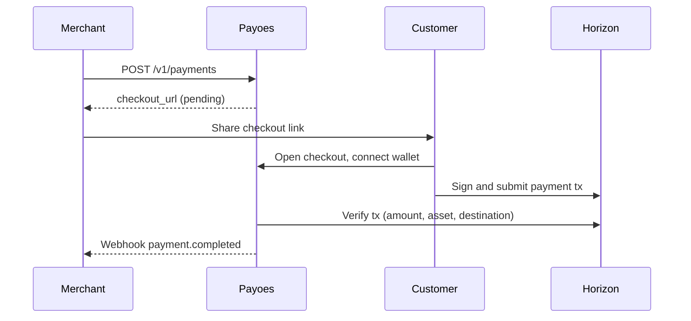

Payoes follows a Stripe-like mental model adapted for Stellar blockchain payments.

## Roles

| Role | Description |
|------|-------------|
| **Merchant** | Your business. Uses the dashboard and API to create payments and manage settings. |
| **Customer** | The person paying. Opens checkout and approves a Stellar transaction. No Payoes account required. |
| **Organization** | Your merchant account in Payoes. Holds settings, API keys, and payment history. |

## Resources

### Organization

An organization represents one business on Payoes. During onboarding you provide a name, logo, and contact details.

Each organization has:

- A **sandbox** or **production** environment
- A **receiving wallet** per environment
- Its own API keys, payments, and webhooks
- **Team members** with role-based access

Edit your organization profile in **Settings → Organization**. Payoes does not charge merchants a platform fee in v1. Customer payments settle on-chain to your receiving wallet.

### Team members

Users who can access your organization dashboard. The creator becomes the **owner** during onboarding.

| Role | Access |
|------|--------|
| **Owner** | Full access, including changing member roles |
| **Admin** | Manage settings, API keys, webhooks, and team invites |
| **Member** | View dashboard, create payments and customers |

Owners and admins can invite teammates by email from **Settings → Team Members**. Invitees receive an email with a link to accept the invitation. They must sign in or create an account with the invited email address before joining.

### Receiving wallet

The Stellar public key where customer payments are sent. Configured during onboarding and editable in **Settings → Receiving Wallet**.

Payoes reads this address when building checkout transactions and when verifying payments on Horizon.

### Payment intent

A single payment request, equivalent to a Stripe Payment Intent.

| Field | Meaning |
|-------|---------|
| `id` | Public ID (`pay_...`) used in API calls |
| `amount` | Stellar amount (up to 7 decimal places) |
| `asset` | `XLM` (native) or `USDC` |
| `status` | `pending`, `completed`, `failed`, or `expired` |
| `source_type` | How the payment was created (`direct`, `checkout_session`, `payment_link`, etc.) |
| `checkout_url` | Legacy hosted page at `/c/pay_...` |

Payment intents are created directly via the dashboard or API, or automatically when you create a checkout session or start checkout from a payment link.

### Checkout session

A hosted checkout flow, equivalent to a Stripe Checkout Session. Each session creates an underlying payment intent.

| Field | Meaning |
|-------|---------|
| `id` | Public ID (`cs_...`) |
| `status` | `open`, `complete`, or `expired` |
| `payment_intent_id` | Linked `pay_...` record |
| `checkout_url` | Hosted page at `/c/cs_...` |

Create checkout sessions from the dashboard or API when you want a dedicated checkout URL with optional success and cancel redirects.

### Payment link

A reusable shareable link, equivalent to a Stripe Payment Link.

| Field | Meaning |
|-------|---------|
| `id` | Public ID (`plink_...`) |
| `url` | Public page at `/l/plink_...` |
| `active` | Whether the link accepts new checkouts |

Each visit to a payment link starts a new checkout session and payment intent.

### Invoice

A bill sent to a customer, equivalent to a Stripe Invoice.

| Field | Meaning |
|-------|---------|
| `id` | Public ID (`inv_...`) |
| `status` | `draft`, `open`, `paid`, or `void` |
| `checkout_url` | Available after finalizing the invoice |
| `customer_id` | Linked customer |

Create an invoice in draft, then finalize it to spawn a checkout session and payment intent.

### Subscription

Recurring billing for a customer, equivalent to a Stripe Subscription.

| Field | Meaning |
|-------|---------|
| `id` | Public ID (`sub_...`) |
| `status` | `active`, `canceled`, or `past_due` |
| `interval` | `month` or `year` |
| `current_period_end` | End of the current billing period |

Use **Bill now** on a subscription to create and finalize an invoice for the current period.

### Checkout

A public hosted page at `/c/{checkout_id}` where `checkout_id` is either `cs_...` (checkout session) or `pay_...` (legacy payment intent).

The checkout flow:

1. Load payment details and merchant branding
2. Customer connects a Stellar wallet (Wallet Kit)
3. Payoes builds an unsigned transaction server-side
4. Customer signs and submits via their wallet
5. Payoes verifies the transaction on Horizon
6. Payment status updates to `completed`

Customers never log into Payoes.

### Transaction

After a successful payment, the Stellar **transaction hash** (`tx_hash`) is stored on the payment intent record. You can look it up on Stellar Explorer for the corresponding network (testnet or mainnet).

### API key

Secret credential for server-to-server API calls. Prefixes:

- `pk_test_...`: sandbox (Stellar testnet)
- `pk_live_...`: production (Stellar mainnet)

API keys are tied to one organization and one environment.

### Webhook

HTTP callbacks sent to your server when payment events occur. Use webhooks to unlock products, send receipts, or update your database without polling.

## Payment lifecycle

## Sandbox vs production

| | Sandbox | Production |
|---|---------|------------|
| Network | Stellar testnet | Stellar mainnet |
| API key prefix | `pk_test_` | `pk_live_` |
| Funds | Test tokens | Real value |

See [Environments](/guides/environments) for details.
